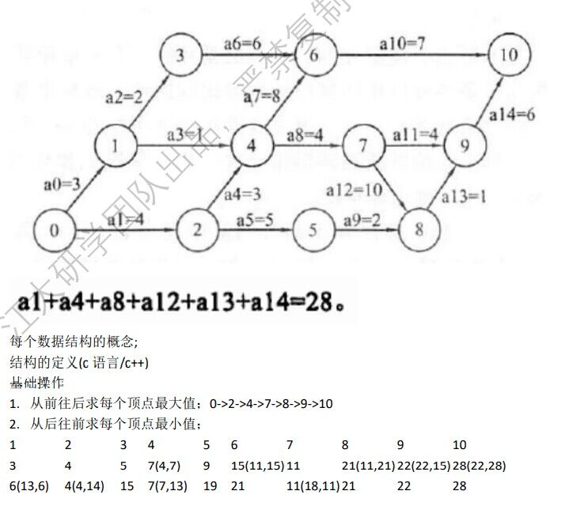

# 第五章图

## 邻接矩阵

基本思想：vexNum表示顶点数量，arcNum表示边数量，edges表示边（1或者权值）

```c++
struct MGraph{
    int edge[Maxn][Maxn];//存储边	edge[i][j]=MAXN 表示两个顶点不通
    int vexNum,arcNum;
};
```

## 邻接表

```c++
struct ArcNode{	//边结构
	int adjvex;//顶点编号一条边里 被指向的那个顶点	
	ArcNode *next;//指针
};
struct VNode{	//顶点结构
	int data;//顶点信息
	ArcNode *firstarc;
};
struct AGraph{	//表
	VNode adjlist[Maxn];//存储所有顶点链表  存了所有顶点 以及他们所指向的边
	int vexNum,arcNum;
};
```

## 图的遍历

### 图的深度优先遍历

#### 思想:

1.首先，访问开始结点从起始结点开始任选一个相邻并未被访问的结点，访问；

2.接着，把找到的结点作为起始结点继续访问其相邻且未被访问的一个结点;

3.重复 2 的操作直到某一个结点所有相邻结点都被访问，则退回最近被访问且还有相邻结点 未被访问的结点； 

4.把 3 中结点作为起始结点继续执行 2，3 操作直到所有结点都被访问完为止。

```c++
void visit(int x){
    cout << x << "\t";
}
void DFS(AGraph *g,int v,int vis[]){	//标记数组初始化为0
    ArcNode *p;		//用来指向节点的边（访问）
    vis[v] = 1;		//可以定义为全局变量
    visit(v);		//访问开始节点
    p = g->adjlist[v].firstarc; 	//顶点v的第1个边
    //从起始节点开始任选一个相邻且未被访问的节点
    while(p != NULL){
        //未被访问
        if(vis[p->adjvex != 1])	
            //把找到的节点作为起始节点继续访问
            DFS(g,p->adjvex, vis);
        //则退回最近被访问且还有相邻节点未被访问的节点
        p = p->next;
    }
}
```

### 图的广度优先遍历

#### 思想：

1.首先，从起始结点出发访问其所有相邻的且未被访问的结点，并把访问的结点入队；
2.接着，当队列不为空时候队首元素出队并将其作为起始结点执行 1 操作;
3.最后重复执行 2 操作直到队列为空或者所有结点都访问完毕为止。

```c++
void BFS(AGraph *g,int v,int vis[]){
    int que[Maxn];
    int front = rear = -1;
    visit(v);
    vis[v] = 1;		//遍历顶点v
    que[++rear] = v;	//把顶点v入队
    ArcNode *p;			//指向相邻的边
    while(front < rear){	//队不为空
        int k = que[++front];	//取出队首元素
        p = g->adjlist[k].firstarc;	//指向队首元素的边（相邻的节点）
        while(p != NULL){
            //若未被访问
            if(vis[p->adkvex] == 0){
                que[++rear] = p->adjvex;	//入队
                visit(p->adjvex);			//访问
                vis[p->adjvex] = 1;			//标记为已被访问
            }
            p = p->next;
        }
    }
}
```

### 图不连通的时候（一个顶点不足以访问全部的顶点）

```c++
//深度优先遍历
void dfs(AGraph *g,int v,int vis[]){
    for(int i = 0;i < g->vexNum;i++)
        if(vis[i] == 0)
            DFS(g,v,vis);
}
//广度优先遍历
void bfs(AGraph *g,int v,int vis[]){
    for(int i = 0; i < n;i++)
        if(vis[i] == 0)
            BFS(g,v,vis);
}
```

### 最小生成树

如果连通图是个带权图，则其生成树中的边也带权，生成树中所有边的权值之和称为生成树的代价。

最小生成树：带权连通图中代价最小的生成树称为最小生成树。

#### prim（普里姆算法）：归并点

思想：

1.从起点顶点开始，将与起始顶点相邻的边作为候选边；

2.从候选边中挑选一条最短且不与生成树构成回路的路径输出，并将这一条边（包含顶点）加入生成树中，将与这条边相邻的边加入候选边中；

3.重复执 2 操作，直到所有节点都被访问。

```c++
void Prim(MGraph *g,int v){
    int sum = 0;	//权值和
    int vis[Maxn];	
    int lowcost[Maxn];	//生成树到其余顶点最小距离
    for(int i = 1 ; i < g->vexNum;i++){
        //候选边初始化
        lowcost[i] = g->edges[v][i];
        vis[i] = 0;
    }
    vis[v] = 1;
    int j, k;
    for(int i = 1; i < g->vexNum;i++){		//循环次数 n-1次
        int minnest = Maxn;
        for(j = 1; j < g->vexNum;j++){		//找最小值
            //从候选边中选出最小边且不与生成树构成回路
            if(lowcost[j] < minnest && vis[j] == 0){
                minnest = lowcost[j];
                k = j;
            }
        }
    }
    sum += minnest;
    vis[k] = 1;
    //维护候选边中的最小值
    for(j = 1;j < g->vexNum;j++){
        //只有未被访问过的顶点才可能更换权值
        if(vis[j] == 0 && g->edges[k][j] < lowcost[j])
            //维护到生成树的最小距离
            lowcost[j] = g->edges[k][j];
    }
}
```

#### 克鲁斯卡尔：归并边

思想：

1.将图中的边按照权值从小到大进行排序；

2.从最小边开始扫描，如果加入生成树中不构成回路，则加入生成树；并查集判断是否构成回路（判断边的两个顶点的根节点是否相同）

3.重复 2 操作，直到所有边都被扫描为止。

```c++
struct Road{
    int a, b;		//两个边的顶点
    int weight;		//权值
    boll operator < (Road a)const{		//固定写法   在sort()中应用cmp
        return weight < a.weight;		//从小到大排序 (> 从大到小)
    }
};
int v[Maxn];	//并查集数组
//返回并查集数组中下标为a的根结点
int getRoot(int a){
    while(a != v[a])		//v[a]指向a的父亲节点
        a = v[a];	  
    retur a;				//返回a的根节点
}
Road road[Maxn];		//存储边的数组
void Kruskal(MGraph *g,int v){		//AGraph：邻接表 MGraph：邻接矩阵
    int sum = 0;		//权值和
    int e = g->arcNum;	//边
    int v = g->vexNum;	//顶点个数
    //从下标为1开始到 1+e （不包括），应用cmp函数进行排序
    sort(road + 1,road + 1 + e , cmp);
    for(int i = 1; i <= v; i++)
        v[i] = i;	//并查集数组初始化
    for(int i = 1; i <= e; ++i){	//从小到大遍历边
        int a = getRoot(road[i].a);
        int b = getRoot(road[i].b);
        //判断根节点是否相等
        if(a != b){		
            sum += road[i].weight;
            if(a < b)
                v[a] = b;	//将a加入b的并查集，把b（大的）作为父节点
            else
                v[b] = a;
        }
    }
}
```

### 最短路径

#### 迪杰斯特拉  ：

最短路径    	单源点最短路径   **和prim对比记忆**

思想：

1.将起始结点v并入空集S中，将其余结点并入空集T中；

2.从T中选出一条到v顶点中的最短路径，加入集合S中，并更新v到T中其余各顶点的最短路径；（不能重复访问）prim

3.重复 2 操作直到所有顶点都并入S中为止。

```c++
void Dijkstra(MGraph *g, int v){
    int vis[Maxn];		//标记数组
    //v到任一顶点的前一顶点，标记路径path[i]:到顶点i的前一个顶点
    int path[Maxn];		
    int dist[Maxn];		//v到其余顶点的路径长度，候选边
    //初始化三个数组
    for(int i = 0;i < g->vexNum; i++){	
        dist[i] = g->edges[v][i];		//候选边赋值
        vis[i] = 0;
       /*
        if(g->edges[v][i] < Maxn)		//v与i之间有路径
            path[i] = v;
        else
            path[i] = -1;				//表示v不能到达i
        */
    }
    vis[v] = 1;
    //path[v] = -1;		//顶点v自身
    int k;				//标记最小值位置
    for(int i = 1;i < g->vexNum;i++){		//执行n-1次归并n-1个顶点
        int minn = Maxn;
        //取未被访问过的最小值
        for(int j = 0;j < g->vexNum;j++)
            if(dist[j] < minn && vis == 0){
                minn = dist[j];
                k = j;
            }
    }
    vis[k] = 1;	//除了之前的最短路径 v->k->j(任意顶点) 和prim算法对比记忆
    //维护最短路径
    for(int j = 0;j < g->vexNum;j++)
        if(vis[j] == 0 && dist[k] + edges[k][j] < dist[j]){
            dist[j] = dist[k] + edges[k][j];
            //path[j] = k;	//j的前一个顶点就是k
        }
}
//打印路径 从后往前需要栈 path[j]:存储到顶点j的前一个顶点
void Print(int path[], int j){
    int stc[Maxn];
    int top = -1;
    while(path[j] != -1){	//有路径
        stc[++top] = j;		//进栈
        j = path[j];		//j指向前一个顶点
    }
    stc[++top] = j;
    //栈的输出
    while(top != -1)		
        cout << stc[--top] << '';
    cout << endl;
}
```

#### 弗洛伊德：任意一对顶点的最短路径

思想：

1.首先开一个二维数组存放图中各边的权值，再开一个二维数组存放各路径;

2.接着开个三重循环，外层从1到n表示每次比较中间的结点，中间一层表示行的枚举，最内层表示列的枚举；

3.利用三重循环，每一次比较边的两端点直接路径与加入中间结点的路径长短，如小于则用加入中间结点的路径值来替代两端点的直接路径值（取它们最小值），并把中间结点接入路径数组中；

4.完成三个循环结束。

```c++
//A用来记录当前已经求得的任意两个顶点最短路径的长度
//path用来记录当前两个顶点间最短路径上要经过的中间结点
void Floyd(MGraph *g,int v,int A[][],int path[][]){
    for(int i = 0;i < g->vexNum;i++)
        for(int j = 0;j < g->vexNum;j++){
            A[i][j] = g->edges[i][j];
            //将路径初始化为-1 i->j(没有中间结点)
            path[i][j] = -1;
        }
    //利用三重循环求任意一对顶点的最短路径
    for(int k = 0;k < g->vexNum;k++)	//中间结点
        for(int i =0;i < g->vex)		//行的枚举
            for(int j = 0;j < g->vexNum;j++)	//列的枚举
                if(A[i][j] > A[i][k] + A[k][j]){
                    A[i][j] = A[i][k] + A[k][j];
                    path[i][j] = k;
                }
}
//运用递归与中间结点输出路径
//path[i][j]:存储i->j的中间结点
void Print_f(int u,int v,int path[][],int A[][]){
    //无路径直接返回 终止条件
    if(A[u][v] == Maxn)
        return;
    //无中间结点直接输出
    else if(path[u][v] == -1)
        cout << u <<' '<< v;	//解决本次步骤
    //运用递归与中间结点输出路径  递归转移方程
    else{
        int mid = path[u][v];		//存储u->v的中间结点
        Print_f(u, mid, path, A);	//递归遍历u->mid的路径
        Print_f(mid, v, path, A);	//递归遍历mid->v的路径
    }
}
```

### 拓扑排序：判断是否为有向无环图（删除的结点是否为n个）

思想：从入度为0的结点开始删除（每次删除结点和相关的边）

1.首先将图中入度为0的结点入栈，栈初始为空；

2.当栈非空时栈首元素出栈，访问并且将与元素相邻顶点的入度减1；（去掉相关的边）

3.当某个顶点在去掉相关边后入度为0，则入栈；

4.重复执行 2 3 操作，并且同届访问顶点个数直到栈空。

```c++
//邻接表
struct ArcNode{
	int adjvex;
	ArcNode *next;
};
struct VNode{
	int data;
	int cnt;//入度个数
	ArcNode *firstarc;
};
struct AGraph{
	VNode adjlist[Maxn];
	int vexNum,arcNum;
};

int Puop(AGraph *G){
    int n = 0;
   	int stc[Maxn],top = -1;
    //访问所有顶点  入度为0入栈
    for(int i = 0;i < G->vexNum;i++)
        //1.首先将图中入度为0的结点入栈，栈初始为空
        if(G->adjlist[i].cnt == 0)
            stc[++top] = i;
    ArcNode *p;
    //2.当栈非空时栈首元素出栈，访问并且将与此元素相邻顶点的入度-1（去掉相关的边）
    while(top != -1){
        //出栈
        int k = stc[top--];
        visit(k);
        n++;	//统计出栈元素个数
        //指向顶点k的相邻边
        p = G->adjlist[k].firstarc;
        while(p != NULL){
            //取相邻边的顶点
            int j = p->adjvex;
            --G->adjlist[j].cnt;
            if(G->adjlist[j].cnt == 0)
                stc[++top] = j;
            p = p->next;
        }
    }
    //判断是否有向无环图
    if(n == G->vexNum)
        return 1;
    else
        return 0;
}
```

### 求 AOE 中关键路径和关键活动（给你图要会求关键路径）

