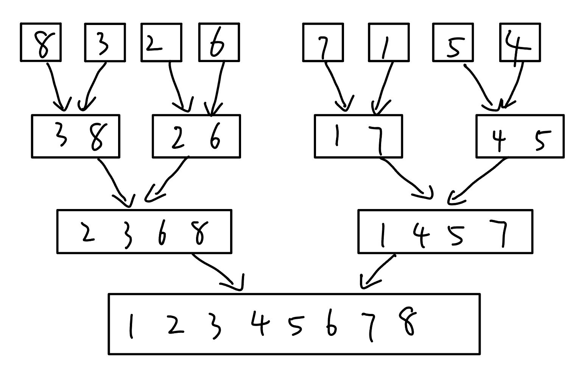

## 19-20真题

### 自操作表，指表中元素被find函数访问到，就自动移动到表头，并保持其他元素顺序不变

1. 用数组存储结构写find功能
2. 写链表存储结构的find功能

```cpp
void Find(char a[],int n,char e){
    //n为数组长度，e为要查找的元素
    for(int i=0;i<n;i++){
        if(a[i]==e){
            //找到元素之后
            for(int j=i-1;j>=0;j--){
                a[j+1]=a[j];//i-1位置之前的所有结点后移
            }
            a[0]=e;
        }
    }
}

struct LNode{
    char data;//数据域，保存结点的值
    struct LNode *next;//指针域
};
void Find(LNode *L,char e){
    LNode *p=L->next,*q=L;
    while(p!=NULL&&p->data!=e){
        p=p->next;
        q=q->next;
    }
    if(p->data==e){
        q->next=p->next;//删除p
        p->next=L->next;//将p移动到头结点
        L->next=p;
    }else{
        cout<<"所要查找的结点不存在！！"<<endl;
    }
}

```

### 2. 只用一个二叉树根节点指针T，用高效率方法，计算

1. 所有结点个数
2. 所有叶子结点个数
3. 所有满结点个数/所有满状态结点个数

```cpp
/*
递归函数实现的二叉树遍历算法是很低效的，我们采用线索二叉树算法。Tnorder算法输出的a,b,c为相应的结点个数、叶子结点个数和满状态结点个数
*/
struct TBTNode{
    char data;
    int ltag,rtag;//线索标记
    struct TBTNode *lchild;
    struct TBTNode *rchild;
}
void Tnorder(TBTNode *T){
    int a=0,b=0,c=0;
    for(TBTNode *p=Frist(T);p!=NULL;p=Next(p)){
        //遍历中序线索树
        a++;
        if(p->ltag==1&&p->rtag==1)
            b++;
        if(p->ltag==0&&p->rtag==0)
            c++;
    }
    cout<<"所有结点个数："<<a<<endl;
    cout<<"叶子结点个数："<<b<<endl;
    cout<<"满状态结点个数："<<c<<endl;
}
TBTNode *Frist(TBTNode *p){
    //求以p为根的中序线索二叉树，中序序列下的第一个结点的算法
    while(p->ltag==0){
        p=p->lchild;
    }
    return p;
}
TBTNode *Next(TBTNode *p){
    //求中序线索二叉树中结点p在中序下的后继结点的算法
    if(p->rtag==0)
        return Frist(p->rchild);
    return p->rchild;//rtag=1,直接返回后继线索
}

```

### 简述如何不用递归实现归并排序，并实现过程



```cpp
/*
将数组中的相邻元素两两配对，用Merge()函数将他们排序，构成n/2组长度为2的排序好的子数组段，然后再将他们合并成长度为4的子数组段，如此继续下去，直至整个数组排好序。
*/
#include<iostream>
#include<algorithm>
using namespace std;
#define maxn 100
int num[maxn];
template<class Type>
void Merge(Type a[],Type b[],int left,int mid,int right){
    int i=left;
    int j=mid+1;
    int k=left;
    while(i<=mid&&j<=right){
        if(a[i]<a[j])
            b[k++]=a[i++];
        else
            b[k++]=a[j++]
    }
    if(i>mid)
        for(int z=j;z<=right;z++)
            b[k++]=a[z];
    else
        for(int z=i;z<=mid;z++)
            b[k++]=a[z];
}
//合并大小为s的相邻子数组
void MergePass(Type x[],Type y[],int s,int n){
    int i=0;
    while(i+2*s-1<n){
        Merge(x,y,i,i+s-1,i+2*s-1);
        //合并大小为s的相邻2段子数组
        i+=2*s;
    }
    if(i+s<n)
//剩下的元素个数m满足:s<=m<2*s
        Merge(x,y,i,i+s-1,n-1);
    else
//剩下的元素个数m满足：m<s
        Merge(x,y,i,i,n-1);
}
template<class Type>
void MergeSort(Type c[],int n){
    Type *d=new Type[n];
    int s=1;
    while(s<n){
        MergePass(c,d,s,n);//合并到数组d
        s+=s;
        //就像图中有序的两个合并为一个
        MergePass(d,c,s,n);//合并到数组c
        s+=s;
    }
delete[] b;
}
int main(){
    int n;
    while(cin>>n){
        for(int i=0;i<n;i++)
            cin>>num[i];
        MergeSort(num,n);
        for(int i=0;i<n;i++)
            cout<<num[i]<<endl;
    }
    return 0;
}
```

### 实现输入n个0 ~ 1000的整数，n属于0 ~ 1000输出这些整数及他们的出现次数。输出到文件"out.txt"。输出顺序按照出现次数由大到小，次数相同时，数值小的在前

输入

12

5 3 3 4 5 6 8 7 9 6 4 3

输出

3 3,4 2,5 2，6 2，7 1，8 1,9 1

```cpp
#include<stdio.h>
typedef struct E{
    int data;//数据域，保存结点的值
    int times;//统计次数
}E;
void tongji(int a[],int n){
    //n代表数组长度 初始化
    E arr[1000],m;
    arr[0].data=a[0];
    arr[0].times=1;
    int i=1,j=0;//i是原数组下标，j是新数组下标
    int p=0,q=0,r=0;
    for(int s=1;s<1000;s++){
        arr[s].times=-1;//初始化
    }
    while(i<n){
        j=0;
        while(a[i]!=arr[j].data&&arr[j].times!=-1) j++;
        if(arr[j].times==-1){
            //无相同元素
            arr[j].data=a[i];
            arr[j].times=1;
            p=j,q=j;
            //调换，次数大的在前面，次数相同的数字小的在前
            while(arr[p].times>arr[p-1].times&&p>0){
                m=arr[p];
                arr[p]=arr[p-1];
                arr[p-1]=m;
                p--;
            }
            while(arr[q].times==arr[q-1].times&&arr[q].data<arr[q-1].data&&q>0){
                m=arr[q];
                arr[q]=arr[q-1];
                arr[q-1]=m;
                q--;
            }
        }
        else{
            //相同元素
            arr[j].times++;
            p=j,q=j;
            //调换，次数大的在前面，次数相同的数字小的在前
            while(arr[p].times>arr[p-1].times&&p>0){
                m=arr[p];
                arr[p]=arr[p-1];
                arr[p-1]=m;
                p--;
            }
            while(arr[q].times==arr[q-1].times&&arr[q].data<arr[q-1].data&&q>0){
                m=arr[q];
                arr[q]=arr[q-1];
                arr[q-1]=m;
                q--;
            }
        }
        i++;
        if(r<j) r=j;
    }
    //输出到文件
    FILE *fp;
    fp=fopen("example.txt","w");
    for(int i=0;i<=r;i++)
        fprintf(fp,"%d %d",arr[i].data,arr[i].times);
    fclose(fp);
}
int main(){
    int n,i;
    bool flag=true;
    cin>>n;
    if(n<0||n>1000)
        cout<<"输入错误！"<<endl;
    else{
        int arr[100];
        for(i=0;i<n;i++) cin>>arr[i];
        for(i=0;i<n;++i){
            if(arr[i]<0||arr[i]>1000){
                flag=false;
                break;
            }
        }
        if(flag)
            tongji(arr,n);
        else
            cout<<"输入有误！"<<endl;
    }
}
```

### 5. 堆排序

```cpp
#include<stdio.h>
#include<malloc.h>
void sift(int a[],int low,int high){//在low到high范围内对下标为low的元素进行调整
    int i,j;
    i=low,j=2*i;
    int temp=a[low];//以low为根向下交换temp存储我们要调整的元素值
    while(j<=high){//当孩子结点下标合法
        if(j<high&&a[j]<a[j+1])j++;//大顶堆 与较大的孩子进行比较
        if(temp<a[j]){
            a[i]=a[j];//把孩子结点上调代替父亲节点的位置
            i=j;
            j=2*i;//依次向下进行比较和调整，把较大值孩子结点的下标赋值给i，j指向较大值孩子结点的孩子结点下标。
        }else
            break;
    }
    a[i]=temp;//插入
}
void HeapSort(int a[],int n){
    int temp;
    for(int i=n/2;i>0;i--)sift(a,i,n);
    for(int i=n;i>=2;i--){
        temp=a[1];//每次和最大值交换
        a[1]=a[i];
        a[i]=temp;
        sift(a,1,i-1);//只需要调整一次就好
    }
}
```

