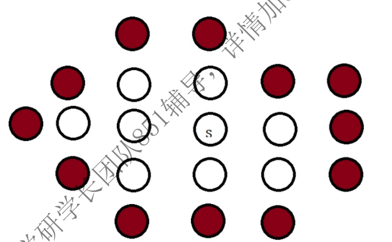

## 851_2021

### 1. 链表题

1. 什么是线性结构，写出线性结构的特点
2. 写出删除链表头结点的算法

```cpp
/*
(1)线性结构的特点是在数据元素的非空有限集中：
①存在惟一的一个被称作“第一个”的数据元素和惟一的一个被称作“最后一个”的数据元素；
②除第一个之外，集合中的每个数据元素均只有一个前驱；除最后一个之外，集合中的每一个数据元素均只有一个后继。线性结构的数据元素之间存在一对一的线性关系。线性结构拥有两种不同的存储结构，即顺序存储结构和链式存储结构。顺序存储的线性表称为顺序表，顺序表中的存储元素是连续的，链式存储的线性表称为链表，链表中的存储元素不一定是连续的，元素节点中存放数据元素以及相邻元素的地址信息。
线性结构中存在两种操作受限的使用场景，即队列和栈。栈的操作只能在线性表的一端进行，就是我们常说的先进后出（FILO），队列的插入操作在线性表的一端进行而其他操作在线性表的另一端进行，先进先出（FIFO），由于线性结构存在两种存储结构，因此队列和栈各存在两个实现方式。
*/
Node *DeleteHead(Node *pHead){
    if(PHead==NULL) return NULL;//链表为空表,返回NULL
    Node *pTemp = pHead->next;//pTemp 指向表头的后一个结点
    free(pHead);//直接删除表头，释放头节点的内存
    if(pTemp==NULL)return NULL;//原表只有表头一个几点，故删除后只剩下NULL
    pHead=pTemp;
    return pHead;
}
```


### 2. 如图所示，阴影部分为边界像素，像素点着色算法的原理如下

我们先选取s点，将其置为区域中的已知颜色，再按右上左下的方式将其邻接点着色



1. 栈是什么？有什么特点？
2. 请描述该算法的过程
3. 画图展示该算法的运行过程

```cpp
/*
(1)栈也是用来存储逻辑关系为“一对一”数据的线性存储结构，同顺序表和链表一样。
特点：
①栈只能从表的一端存取数据，另一端是封闭的；
②在栈中，无论是存数据还是取数据，都必须遵循“先进后出”的原则，即最先进栈的元素最后出栈

(2)算法步骤：
1.将s点入栈
2.将栈顶元素出栈
3.探索栈顶元素周围按照右上左下的顺序判断是否是合法的活结点，合法的活结点必须符合：
（1）该点是像素点而不是边界；（2）该点未被染色
4.将合法的活结点入栈
重复执行2-4步骤，直至栈空，表示所有像素已经着色。
*/
```


### 3. 综合快速排序，回答下面问题：

1. 叙述冒泡排序的过程
2. 设计实例，叙述快速排序的过程

```cpp
/*
(1)
比较两个相邻的元素，将值大的元素交换到右边。
一趟比较过程：依次比较相邻的两个数，将比较小的数放在前面，比较大的数放在后面。
①第一次比较：首先比较第一和第二个数，将小数放在前面，将大数放在后面。
②比较第 2 和第 3 个数，将小数 放在前面，大数放在后面。
③如此继续，知道比较到最后的两个数，将小数放在前面，大数放在后面，重复步骤，直至全部排序完成
④在上面一趟比较完成后，最后一个数一定是数组中最大的一个数，所以在比较第二趟的时候，最后一个数是不参加比较的。
⑤在第二趟比较完成后，倒数第二个数也一定是数组中倒数第二大数，所以在第三趟的比较中，最后两个数是不参与比较的。
⑥依次类推，每一趟比较次数减少依次

49, 38, 65, 97, 76, 13, 27
首先将第一个元素49作为基准
设变量j从27从右向左找比基准小的元素，设变量i从49开始向右找到比基准大的元素，
找到27和65后，交换他们则第一次交换后：49, 38, 27, 97, 76, 13, 65。
继续移动ij找到对应元素并交换多次交换后序列为：49, 38, 27, 13, 76, 97, 65，
并且ij相遇在元素13把基准元素和ij相遇所在位置交换:13,38, 27, 49, 76, 97, 65
此时，49左边小于49，右边大于49，可以把把问题变成两个更小规模的相同的子问题，
继续递归下去，直到区间为1
*/
```

### 4. 结合计算机算法设计与分析

1. 什么是动态规划？动态规划和分治法的区别是什么？
2. 举例说明，动态规划求解最优化问题的过程？

```cpp
/*
动态规划：当前需要求解的问题可以分解为多个子问题，问题的最优解如果可以由子问题的最优解推导得到，则可以先求解子问题的最优解，再构造原问题的最优解；若子问题有较多的重复出现，为此动态规划仅解决每个子问题一次，从而减少计算量，即一旦某个给定子问题的解已经算出，则将其记忆化存储，以便下次需要同一个子问题解之时直接查询。最后则自底向上从最终子问题向原问题逐步求解。

分治算法是把原问题分解为若干独立的子问题，子问题与子问题间相互独立，不存在重复求解子问题的情况，自顶向下求解子问题，合并子问题的解，从而得到原问题的解。


举例为0-1背包问题：
在 N 件物品取出若干件放在容量为 W 的背包里，每件物品的体积为 W1，W2……Wn（Wi 为整数），与之相对应的价值为 P1,P2……Pn（Pi 为整数），求背包能够容纳的最大价值。
像这种固定数值的组合问题，比如这个问题的 W 总容量，跟下个实例零钱问题的总钱数，都是适合用动态规划来解决的问题，对于这样的问题，动态规划的解法就是：创建一个二维数组，横坐标是从 1 开始到 W，纵坐标是组成 W 的各种元素，本题中就是指 W1，W2……Wn，数组中每个位置（i，j）的数字就是当组成元素只有 W1，W2……Wi，背包可放容量为 j 时的结果，本题中就是容纳的最大价值。所以很容易分析出，当（i，j）时，如果 Wi 能放的下，空间减小，但是会增加 Pi 的价值，如果 Wi 不能放的下，空间不变，是（i-1，j）的价值，取其中最大值就好了，即状态转化方程为能放的下，dp[i][j] = max(dp[i-1][j],dp[i-1][jw[i]]+p[i])；放不下，dp[i][j] = dp[i-1][j]；对于前面规模更小的dp[i][j]记录最优值，当要解决更大规模的问题时，可以直接O(1)查询结果，而不必自顶向下的多次求解。最后，dp[n][v]即为最终的最优值。

*/

```

### 5. Fibonacci函数表达式为：

f(1)=f(2)=1;

f(n)=f(n-1)+f(n-2),(n>=3，且n为N+)

1. 用递归思想写出代码，关键部分加上注释
2. 分析算法的时间复杂度和空间复杂度

```cpp
int Fib(int n)
{
if(n==1||n==2) //递归的出口
    return 1;
else
    return Fib(n-1)+Fib(n-2);
}
/*
假设需要求其中的第 n 位，则可以构建二叉树，二叉树的高度是 n - 1，由我们的基础知识可以知道，一个高度为 k 的二叉树最多可以由 2^k - 1 个叶子节点，也就是递归过程函数调用的次数，所以时间复杂度为O(2^n)，而空间复杂度就是树的高度 S(n)。
*/
```


### 6. 哈夫曼树编码自底向上实现，若定义叶子结点所在层为第一层，其父为第二层，以此类推，处在第n层的结点扫描n-1次，复杂度为o(n^2)

1. 设计能表示二叉树的链表数据结构
2. 基于上述两种数据结构设计一个复杂度为O(n)的哈夫曼树新编码算法，可实现从树根想叶子结点编码，写出思想
3. 编写代码实现上溢问题的算法
4. 分析时间复杂度为什么为O(n)

```cpp
typedef struct _htNode//树节点的结构体
{
    char symbol;
    struct _htNode *left,*right;//左右孩子
}htNode;
typedef struct _htNode//树的结构体,树的根
{
    htNode *root;
}htTree;
/*
将排序好的结点依次放入队列1中
合并两个最小的元素有三种可能，队列1中的前两个，队列2中的前两个，队列1和队列2的第一个。在三种情况下选择和最小的合并。合并后放入队列2中
*/
struct character{
    char ch;//字符
    int time;//该字符出现的次数
};
bool cmp(character a,character b){
    return a.time<b.time;
}
int n;//有n种字母，即n个叶子节点
character arr[30];//根据字母出现次数从小到大排列数组

void initial_work(){
    cin>>n;//输入有n个叶子节点
    for(int i=0;i<n;i++){
        cin>>arr[i].ch>>arr[i].time;
    }
    sort(arr,arr+n,cmp);
}

struct htNode{
    char ch;
    int value;
    struct htNode *left,*right;
};
typedef struct _htNode//树的结构体,树的根
{
    htNode *root;
}htTree;

htNode queone[100];//htNode 类型的数组，用数组模拟队列
int q1h,q2h;//指向两个队列的队首的下标
htNode quetwo[100];
int q1t,q2t;//指向队尾的后一个

int Compare(int x,int y,int z){
    if(x<=y&&x<=z)
        return 1;
    if(y<=x&&y<=z)
        return 2;
    if(z<=x&&z<=y)
        return 3;
}
htTree create(){
    htNode tep;
    for(int i=0;i<n;i++){
        tep.ch=arr[i].ch;
        tep.value=arr[i].time;
        tep.left=NULL;
        tep.right=NULL;
        queone[q1t++]=tep;
    }
    while(q1t-q1h+q2t-q2h>1)//两个队列的元素的个数和大于1
	{
		int x1=inf; int x2=inf; int x3=inf;
        if(q1t-q1h>=2)//队列1中有两个以上元素
        	x1=queone[q1h].value+queone[q1h+1].value;
        if(q2t-q2h>=2)//队列2中有两个以上元素
        	x2=quetwo[q2h].value+quetwo[q2h+1].value;
        if(q1t-q1h>=1&&q2t-q2h>=1)
        	x3=queone[q1h].value+quetwo[q2h].value;
        int Result=Compare(x1,x2,x3);
        if(Result==1)
        {
            tep.value=x1;
            tep.left=&queone[q1h];
            q1h++;
            tep.right=&queone[q1h];
            q1h++; //弹出队列1前两个
            quetwo[q2t++]=tep;//把合并的结果存到队列2中
        }else if(Result==2)
        {
            tep.value=x2;
            tep.left=&quetwo[q2h];
            q2h++;
            tep.right=&quetwo[q2h];
            q2h++; //弹出队列2前两个
            quetwo[q2t++]=tep;//把合并的结果存到队列2中
        }else
        {
            tep.value=x3;
            tep.left=&queone[q1h];
            q1h++;
            tep.right=&quetwo[q2h];
            q2h++; //队列1 2 各弹出一个
            quetwo[q2t++]=tep;//把合并的结果存到队列2中
        }
    }
    htTree tree;
    tree.root=&quetwo[q2h];
    return tree;
}
int ans;
void dfs(htNode *node,int step)
{
    if(node->left==NULL&&node->right==NULL)
    {
    	ans+=(node->value)*step;
    	return ;
    }
    if(node->left!=NULL)
    {
    	dfs(node->left,step+1);
    }
    if(node->right!=NULL)
    {
    	dfs(node->right,step+1);
    }
}

/*
构造哈夫曼树时，每次合并一个元素的代价是3，共有n次合并，时间复杂度是3n，也就是O(n)。
计算哈夫曼的代价值时，只需一次dfs，求和叶子节点的花费即可。时间复杂度也是O(n)
*/
```


### 7. 一个由n个点构成的图，用n*n的矩阵来表示，矩阵由0或1组成，i行j列为0表示i点和j点之间无边，否则i和j之间右边，请你设计算法判断任意两点是否连通。

```cpp
#include<iostream>
using namespace std;
int n;
bool Graph[101][101];
bool vis[101];//标记数组
int ans=0;//ans=1 表示连同，否则不连通
void dfs(int now,int Target){
    if(now==Target){
        ans=1;
        return;
    }
    for(int i=1;i<=n;i++){
        if(Graph[now][i]&&!vis[i])//now 可达 且该店未访问
        {
            vis[i]=1;
            dfs(i,Target);
            vis[i]=0;
        }
    }
}
int main(){
    cin>>n;
    for(int i=1;i<=n;i++)
        for(int j=1;j<=n;j++)
            cin>>Graph[i][j];
    int x,y;//判断x点和y点是否连通
    cin>>x>>y;
    vis[x]=1;
    dfs(x,y);
    if(ans==0)cout<<"不连通"<<endl;
    else cout<<"连通"<<endl;
    return 0;
}
```

